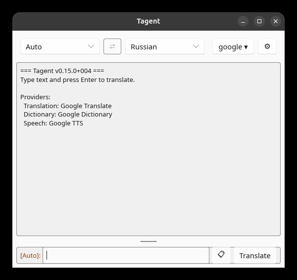

# The main window

From top to bottom:

## The toolbar

- **Source and target language.** The source list starts with `Auto` (detect the
  language). The window opens with the default languages from Settings > General; a
  change here holds until you quit, or until you change the defaults.
- **⇄** swaps the two languages. It is disabled while the source is `Auto`.
- **The provider button** names the translation provider in use, such as `google ▾`.
  Its menu switches providers for this run; see [below](#switching-providers).
- **⚠** appears when a provider in use lacks a required option (an API key, a server
  address). Click it to open Settings on the Providers tab.
- **⚙** opens [Settings](settings.md).

## The transcript

Every translation is added to the transcript, newest at the bottom. Each entry shows
your phrase and its translation, each with its language as a prompt (`[Auto]:`,
`[Russian]:`); a single word shows a dictionary entry: the main translation, the parts of
speech, and the synonyms in brackets. Parts of speech, synonyms, a spelling-correction
notice and errors each get their own color.

The transcript's header names the providers in use for each job.

- **The prompt is the speak button.** Click `[🔊 Auto]:` before a phrase to hear it, in
  its source language (detected if `Auto`); click `[🔊 Russian]:` before the translation
  to hear the translation. For a dictionary entry, only the main translation is read.
  With the prompt turned off (Settings > View), a block starts with just 🔊. The prompt
  is tinted while it plays; click it again to stop, or press **Esc** in any application
  (Windows, and Linux with X11 or XWayland, while the hotkeys are active). Only one entry
  plays at a time: the others can't be clicked meanwhile. With text-to-speech off
  (Settings > General), the 🔊 disappears from the prompts.
- **Right-click** an entry's phrase or translation to copy it as plain text, without
  the prompt. A brief flash of its border confirms the copy. With "Show menu on
  right-click" (Settings > General), right-click opens a **Copy** menu instead.

The transcript is cleared when you quit. Text in it can't be selected with the mouse;
copy with right-click.

## The input box

Type or paste text and press **Enter**, or click **Translate**. **Shift+Enter** starts a
new line. Drag the bar above the box to make it taller.

**📋** puts the clipboard's content into the box, ready to translate.

## Switching providers

The provider button's menu has a section for each job: Translation, Dictionary and
Speech. Each lists the built-in providers and your profiles; a ⚠ marks one that lacks
a required option, and a job that is turned off in Settings shows `(off)`.

A pick holds **for this run only**: the header marks it `(this session)`, and Settings
keeps showing, and saving, your defaults. The pick ends when you quit, pick the default
again, or change that default in Settings. **Providers…** at the bottom of the menu opens
Settings > Providers.

See [How providers work](../providers/how-providers-work.md).

## Closing the window

The window's close button hides it to the tray; Tagent keeps running, and the hotkeys
keep working. **Quit** in the tray menu exits. Without a tray, see
[Tray and startup](tray-and-startup.md#without-a-tray). See [Tray and startup](tray-and-startup.md).
